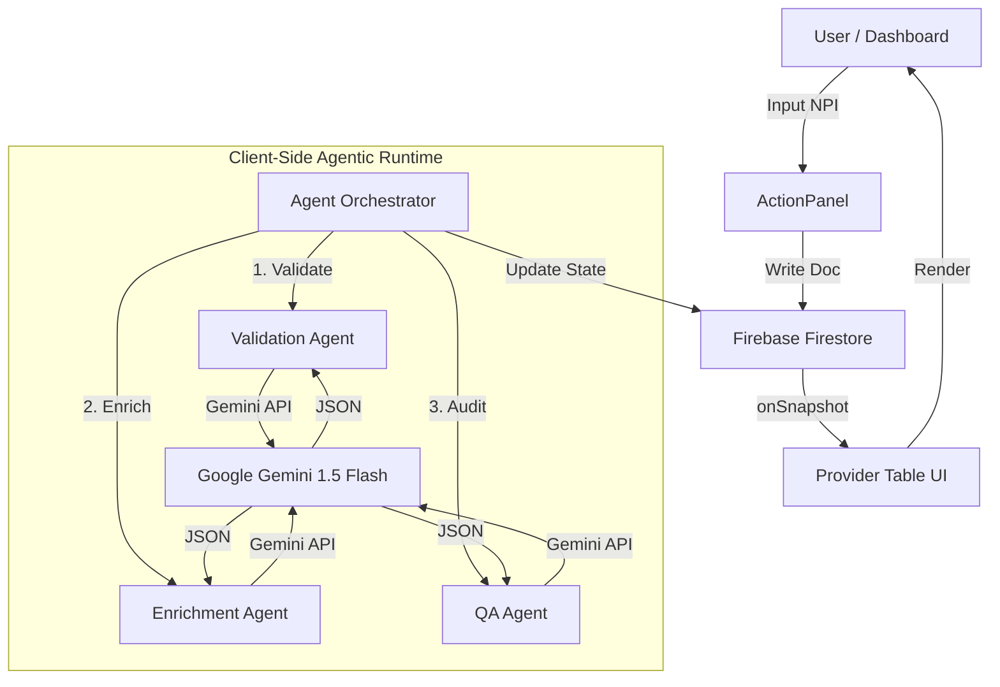

# System Architecture 🏗️

**AstraNova Agentic** leverages a serverless, client-heavy architecture to minimize latency and infrastructure costs while maximizing AI interactivity.

## High-Level Data Flow

## Core Components

### 1. The Dashboard (React + Vite)
-   **Role**: The Mission Control interface.
-   **Tech**: React 19, Tailwind CSS v4, Lucide Icons.
-   **Key Features**:
    -   Real-time data binding via `onSnapshot`.
    -   Glassmorphism UI design for modern aesthetics.

### 2. The Agentic Brain (Google Gemini)
-   **Role**: The intelligence layer.
-   **Model**: `gemini-1.5-flash` (Optimized for speed/latency).
-   **Pattern**: We use "One-Shot Prompting" with strict JSON schema enforcement to ensure agents return structured data (Bio, Status, Confidence) that can be directly rendered by the UI.

### 3. The State Layer (Firebase)
-   **Role**: The single source of truth.
-   **Collections**:
    -   `providers`: Stores the document state, including `validationResult`, `enrichmentData`, and `qaReport`.
-   **Security**: Secured via Firestore Rules (Open for this demo, locked down for production).

## Workflow Stages

1.  **Ingestion**: User submits raw NPI data.
2.  **Validation**: Agent 1 checks format and simulates registry lookup.
3.  **Enrichment**: Agent 2 "hallucinates" (generates) a plausible professional profile to simulate data scraping from LinkedIn/Healthgrades.
4.  **QA Audit**: Agent 3 acts as an adversarial critic, checking Agent 1 and Agent 2's work for consistency.
5.  **Persistence**: Final state is saved as "Ready" or "Flagged".
